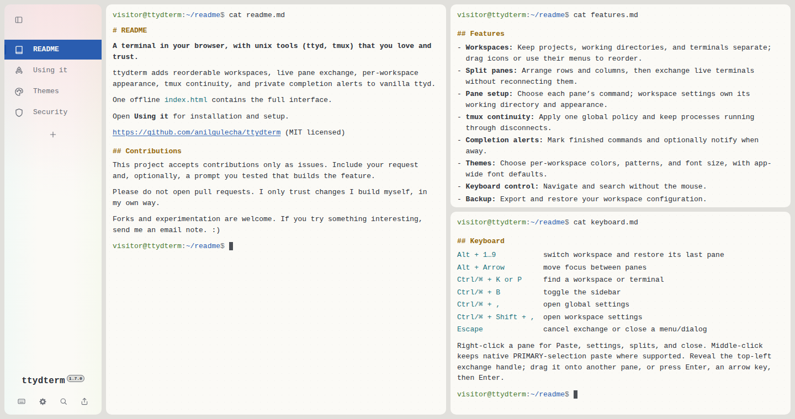

# ttydterm

A terminal in your browser, with unix tools (ttyd, tmux) that you love and trust.

[Open the main site](https://www.gulecha.org/ttydterm/)



## Features

- **Workspaces:** Keep projects and terminals separate, then drag their icons to set the order.
- **Split panes:** Arrange rows and columns.
- **Pane setup:** Choose each command and working directory.
- **tmux continuity:** Keep processes running through disconnects.
- **Completion alerts:** Mark finished commands and notify when away.
- **Themes:** Choose colors, patterns, fonts, and weights.
- **Keyboard control:** Navigate and search without the mouse.
- **Backup:** Export and restore your workspace configuration.
- **Offline:** Run the complete interface from one `index.html`.
- **Hackable:** Build your terminal just like you want it. I've set up the base.

## Run

Install ttyd and tmux:

```bash
# Homebrew / macOS
brew install ttyd tmux

# Debian / Ubuntu
sudo apt install ttyd tmux

# Fedora
sudo dnf install ttyd tmux

# Arch
sudo pacman -S ttyd tmux
```

Download the release file:

```bash
curl -fL https://www.gulecha.org/ttydterm/index.html -o "$HOME/ttydterm.html"
```

Replace `user:password` with credentials you choose, then start ttydterm:

```bash
ttyd -i 127.0.0.1 -p 7681 -W -O -c user:password -I "$HOME/ttydterm.html" -t cursorBlink=false bash -l
```

Open <http://localhost:7681>. Keep the default `127.0.0.1` binding for local use. If you bind ttyd to another interface, add TLS.

The [main site](https://www.gulecha.org/ttydterm/) covers controls, themes, tmux, notifications, security, and configuration.

## Development

Canonical source lives in `src/`. `build.mjs` generates the self-contained `index.html` file.

```bash
bun run build.mjs
python3 -m http.server 8791 &
BASE=http://127.0.0.1:8791/ node test.mjs
git diff --check
```

The project uses globally installed Bun and TypeScript. It has no package manifest, lockfile, or local `node_modules` directory.

## Contributions

This project accepts contributions only as issues. Include your request and, optionally, a prompt you tested that builds the feature.

Please do not open pull requests. I only trust changes I build myself, in my own way.

Forks and experimentation are welcome. If you try something interesting, send me an email note. :)

MIT licensed.
